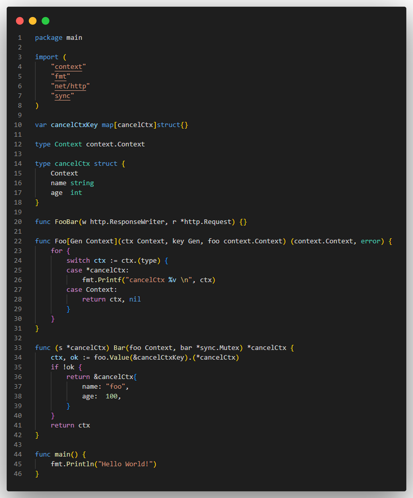
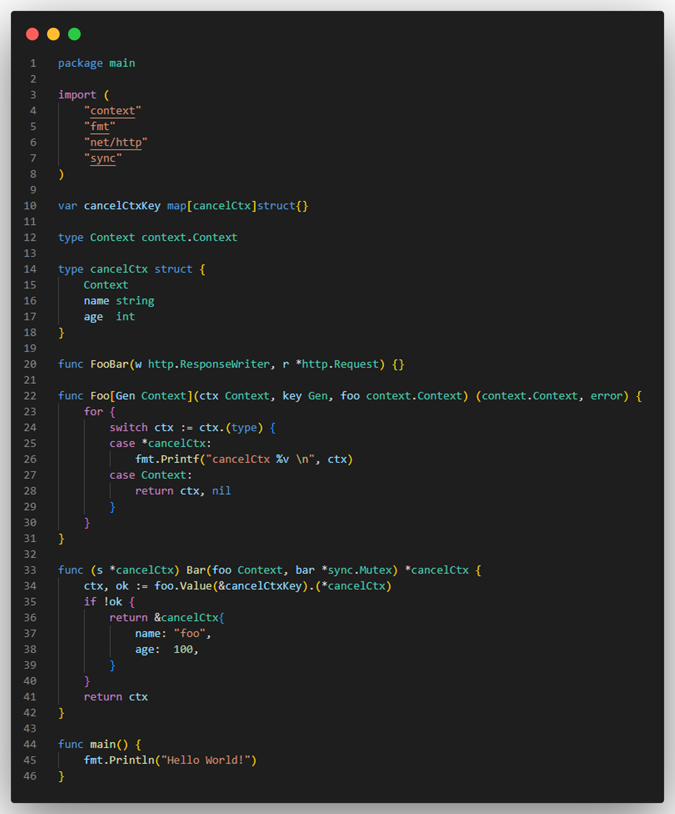
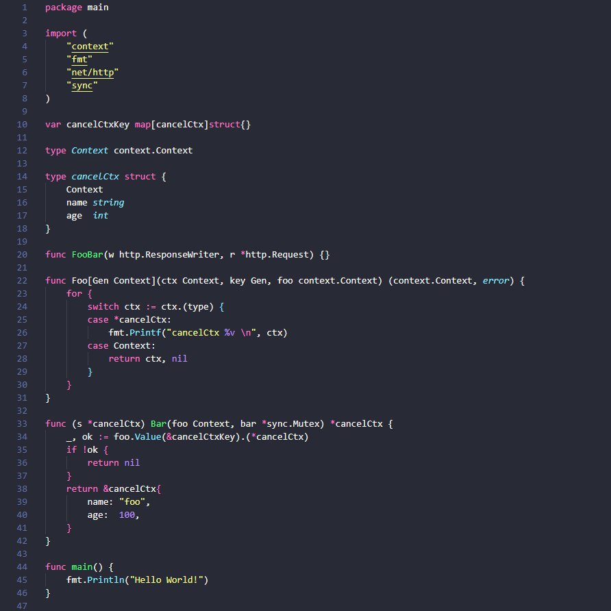
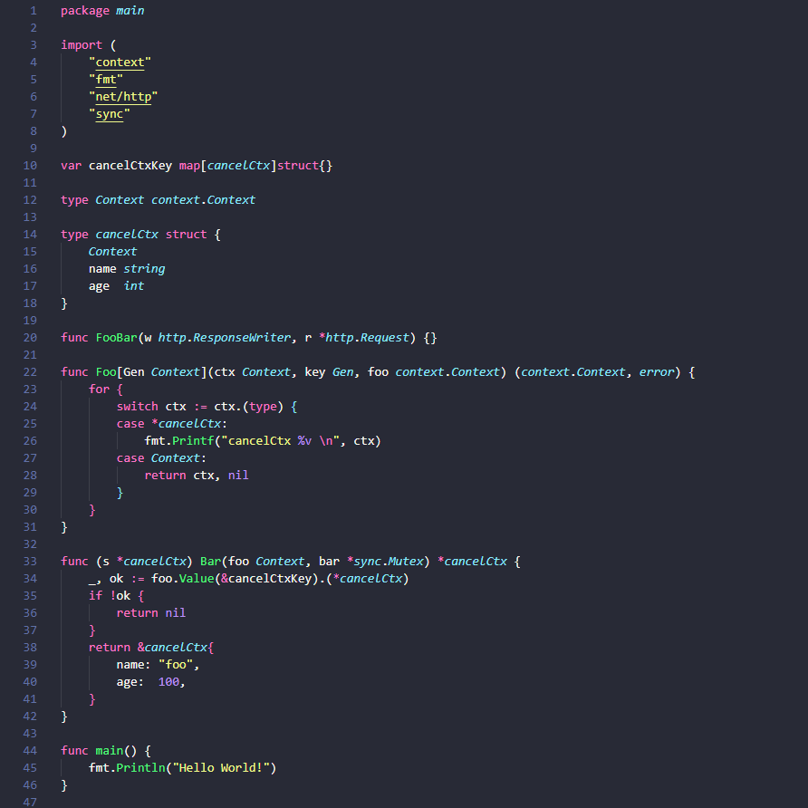
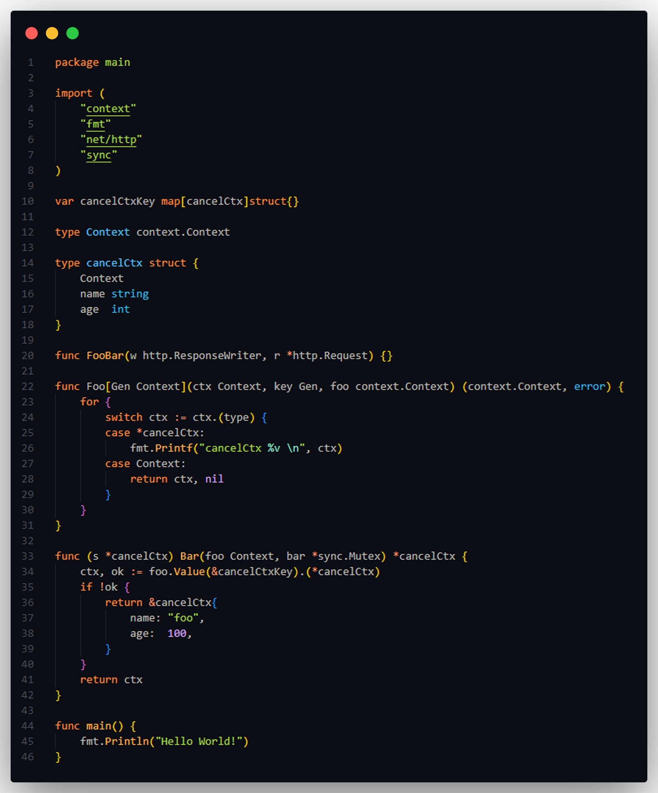
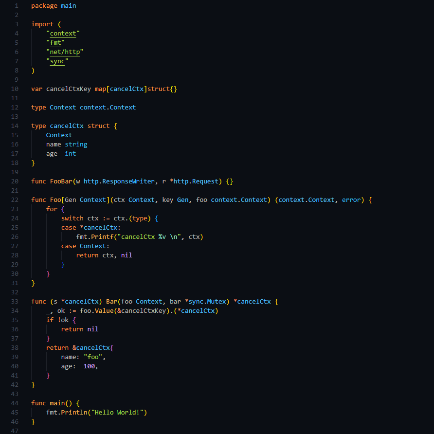

# Go Syntax

Rich Syntax Highlighting for [Go](https://go.dev/) language

With this extension, your favorite theme will be able to color your code better.

## About

Go Syntax improves your coding experience by providing client-side syntax highlighting based on [TextMate rules](https://macromates.com/manual/en/language_grammars). This means you can enjoy advanced code coloring without relying on the Language Server Protocol (LSP).

Go Syntax is compatible with various platforms, including web-based code editors like [vscode.dev](https://vscode.dev) and [github.dev](https://github.dev).

**⚠️ Note**: [Gopls' `ui.semanticTokens` setting](https://github.com/golang/vscode-go/wiki/settings#uisemantictokens) is disabled by default and shouldn't be enabled if you want to use this extension.

## Comparisons (Before - After)

### Dark+ Theme - Before

### Dark+ Theme - After

### Dracula Theme - Before

### Dracula Theme - After

### Ayu Dark Theme - Before

### Ayu Dark Theme - After

## Contributing

Yes, please! Feel free to contribute.

## Credits

This extension enhances [better-go-syntax](https://github.com/jeff-hykin/better-go-syntax) with new features.

Semantic tokens tested thanks to the [vscode-tmgrammar-test](https://github.com/PanAeon/vscode-tmgrammar-test).

## License

[MIT](https://github.com/worlpaker/go-syntax/blob/master/LICENSE)
